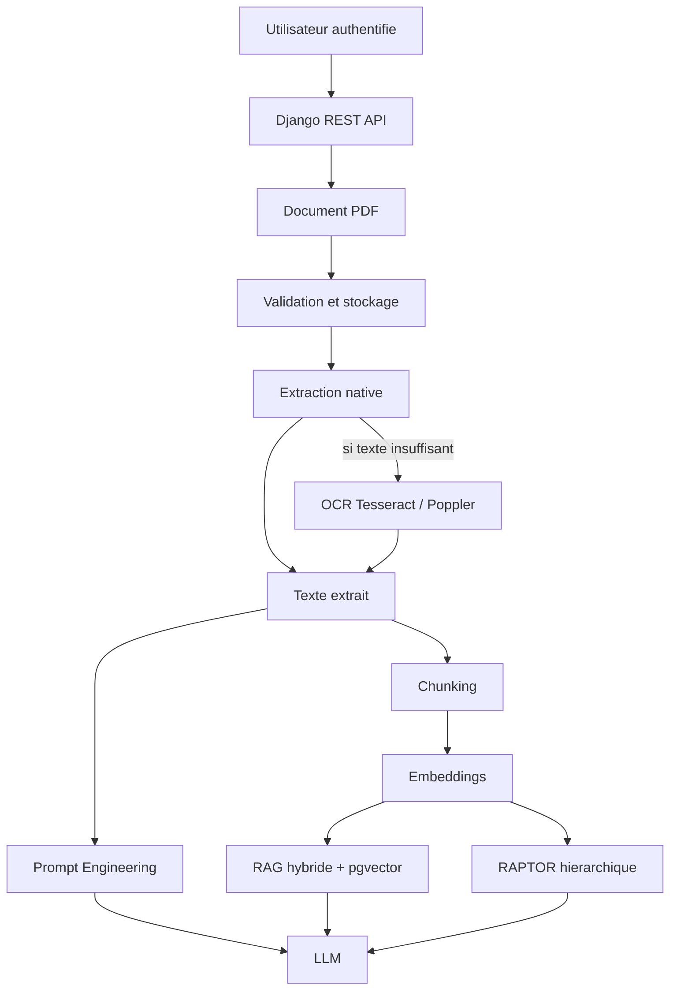

# Tender Intelligence

Tender Intelligence est une application Django REST qui permet de charger des documents PDF d'appels d'offres, d'en extraire le contenu, puis de l'interroger avec trois approches IA independantes : Prompt Engineering, RAG et RAPTOR.

La V1 est finalisee au commit de reference `50e7c473df0d879f0f5c6390b4f019094cf8ad09`.

## Objectif

Le projet vise a comparer des strategies d'analyse documentaire sur des appels d'offres :

- Prompt Engineering : interrogation du texte extrait directement, sans retrieval.
- RAG : recherche hybride sur chunks et embeddings, puis generation contrainte par le contexte retrouve.
- RAPTOR : construction d'une hierarchie de chunks et resumes, puis interrogation hierarchique.

Aucune approche n'est presentee comme gagnante universelle. Les resultats dependent du document, du type de question, des limites de contexte et du fournisseur LLM.

## Fonctionnalites principales

- Gestion securisee des documents PDF par utilisateur.
- Validation des uploads PDF.
- Extraction de texte native.
- Fallback OCR avec Tesseract et Poppler.
- Chunking du texte extrait.
- Embeddings via fournisseur configure.
- Stockage PostgreSQL avec pgvector.
- Recherche semantique et hybride pour RAG.
- Reranking, expansion de requete et fuzzy matching integres au RAG.
- Prompt Engineering sur texte extrait.
- RAG final avec contexte borne.
- RAPTOR hierarchique avec clustering, resumes et traversal top-down.
- API Django REST authentifiee.
- Scripts de benchmark et artefacts d'evaluation.

## Architecture Rapide



Prompt Engineering utilise le texte extrait directement. RAG et RAPTOR dependent des chunks et embeddings.

## Stack

- Python, Django, Django REST Framework.
- PostgreSQL avec extension pgvector.
- `psycopg`, `pgvector`.
- `pypdf` pour l'analyse PDF native.
- `pdf2image`, Pillow, Tesseract via `pytesseract` pour l'OCR.
- Gemini via `google-genai` pour embeddings et LLM.
- scikit-learn et UMAP pour RAPTOR.

## Quick Start

Voir [docs/installation.md](docs/installation.md) pour l'installation complete.

Resume minimal :

```powershell
python -m venv venv
.\venv\Scripts\Activate.ps1
pip install -r requirements.txt
copy .env.example .env
python manage.py migrate
python manage.py createsuperuser
python manage.py runserver
```

La base PostgreSQL, l'extension `vector`, les variables `.env`, Tesseract, Poppler et la cle fournisseur doivent etre configures avant l'utilisation complete.

## Resultats

Deux experiences doivent rester separees.

Evaluation synthetique de generalisation :

- RAG : 25/30 succes.
- RAPTOR : 27/30 succes.
- Prompt Engineering : 4/4 scenarios specifiques.

Benchmark final sur document reel :

- Prompt Engineering : 8 correct / 8.
- RAG : 8 correct / 8.
- RAPTOR : 4 correct, 2 partial, 2 incorrect.

Les details et limites d'interpretation sont documentes dans [docs/benchmarks.md](docs/benchmarks.md).

## Documentation

- [Installation](docs/installation.md)
- [Architecture](docs/architecture.md)
- [Workflow](docs/workflow.md)
- [API](docs/api.md)
- [Benchmarks](docs/benchmarks.md)
- [Securite et limites](docs/security_limits.md)
- [Structure du repository](docs/repository_structure.md)

## Statut

V1 finalisee et documentee. Le code fonctionnel est gele au commit de reference indique ci-dessus.
