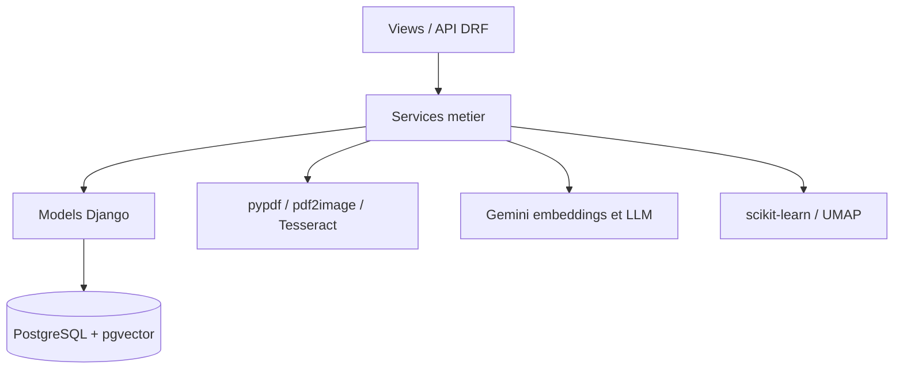
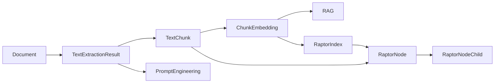

# Architecture

Tender Intelligence est une application Django REST organisee en quatre zones principales :

- `config/` : configuration Django et routage racine.
- `documents/` : gestion des PDF uploades, validation, stockage, permissions et telechargement.
- `extraction/` : extraction texte/OCR, chunking, embeddings, recherche, RAG, Prompt Engineering et RAPTOR.
- `benchmark/` : scripts et artefacts d'evaluation.

## Organisation Generale

Les vues exposent les endpoints REST, les services portent la logique applicative, et les modeles representent l'etat persistant.

## Applications

### `config/`

`config/settings.py` charge `.env`, declare PostgreSQL, les apps Django, les limites de ressources et les parametres IA. `config/urls.py` monte :

- `/admin/`
- `/api/documents/`
- `/api/`

### `documents/`

Cette app gere le cycle de vie des fichiers PDF :

- upload multipart ;
- validation filename, extension, MIME, taille, entete PDF, structure PDF et chiffrement ;
- stockage sous `media/documents/user_<id>/` ;
- liste par proprietaire ;
- telechargement ;
- suppression avec nettoyage fichier.

### `extraction/`

Cette app contient les traitements documentaires :

- extraction native via `pypdf` ;
- fallback OCR via `pdf2image`, Pillow et Tesseract ;
- chunking semantique ;
- embeddings ;
- recherche semantique/hybride ;
- RAG ;
- Prompt Engineering ;
- RAPTOR.

### `benchmark/`

Cette zone contient :

- `evaluate_generalization.py` : lance l'evaluation synthetique.
- `generalization_evaluation.py` : construit et evalue les cas synthetiques.
- `run_benchmark.py` : lance le benchmark reel via API.
- `questions.json` : questions du benchmark reel.
- `evaluation_report.json` : artefact synthetique suivi par Git.
- `results_final.json` : artefact genere localement par le benchmark reel, non suivi par Git.

## Modeles Principaux

### `Document`

Modele de `documents.models`. Il represente un PDF appartenant a un utilisateur :

- `owner`
- `file`
- `original_filename`
- `stored_filename`
- `mime_type`
- `file_size`
- `status`
- metadonnees et erreurs.

### `TextExtractionResult`

Resultat d'extraction associe en one-to-one a un `Document` :

- statut `processing`, `completed` ou `failed` ;
- texte extrait ;
- compte de pages ;
- hash texte ;
- metadonnees extraction/OCR ;
- erreurs.

### `TextChunk`

Segment du texte extrait :

- document ;
- resultat d'extraction ;
- index ;
- offsets ;
- texte ;
- hash ;
- metadonnees.

### `ChunkEmbedding`

Embedding associe a un `TextChunk` :

- fournisseur ;
- modele ;
- dimension ;
- vecteur JSON historique ;
- `embedding_vector` pgvector ;
- statut et erreurs.

### `RaptorIndex`

Index RAPTOR associe a un document :

- statut ;
- version de build ;
- fournisseur et modele ;
- nombre de niveaux, feuilles et noeuds ;
- metadonnees de clustering ;
- erreurs.

### `RaptorNode`

Noeud de la hierarchie RAPTOR :

- index ;
- document ;
- chunk source pour les feuilles ;
- niveau ;
- texte ;
- embedding vectoriel ;
- metadonnees.

### `RaptorNodeChild`

Lien parent/enfant entre noeuds RAPTOR, avec rang d'enfant.

## Les Trois Approches IA

### Prompt Engineering

Prompt Engineering utilise directement le texte extrait du document. Il ne depend pas des chunks, embeddings ni de pgvector. Le contexte est borne par les limites de tokens configurees :

- `PROMPT_ENGINEERING_MAX_QUESTION_CHARS`
- `PROMPT_ENGINEERING_MODEL_INPUT_TOKEN_LIMIT`
- `PROMPT_ENGINEERING_MAX_INPUT_TOKENS`
- `PROMPT_ENGINEERING_TOKEN_SAFETY_MARGIN`
- `PROMPT_ENGINEERING_ESTIMATED_CHARS_PER_TOKEN`

### RAG

RAG depend de :

- `TextChunk`
- `ChunkEmbedding`
- PostgreSQL + pgvector
- recherche vectorielle ;
- recherche lexicale PostgreSQL FTS ;
- fuzzy matching ;
- fusion/reranking ;
- decomposition de requete ;
- contexte borne ;
- appel LLM.

Le fuzzy matching n'est pas une quatrieme approche : il fait partie du pipeline RAG/hybride.

### RAPTOR

RAPTOR depend de :

- chunks ;
- embeddings ;
- clustering ;
- resumes de groupes ;
- `RaptorIndex`, `RaptorNode`, `RaptorNodeChild` ;
- retrieval hierarchique ;
- traversal top-down ;
- contexte borne ;
- appel LLM.

Le top-down traversal est une strategie interne de RAPTOR, pas une approche separee.

## Dependances Principales

