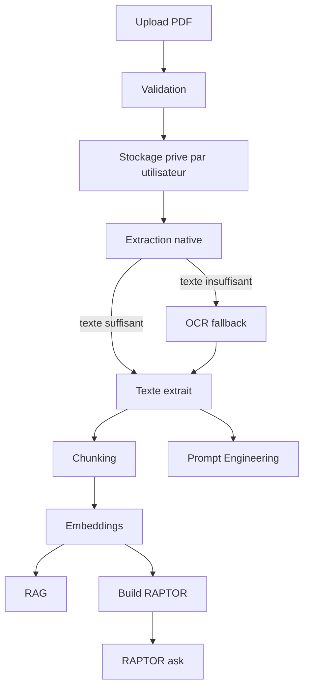

# Workflow

Ce document decrit le workflow technique et utilisateur de la V1.

## Vue A a Z



## 1. Upload

L'utilisateur authentifie envoie un PDF via `/api/documents/`.

Le backend valide :

- presence exacte d'un fichier `file` ;
- extension `.pdf` ;
- nom de fichier exploitable ;
- taille non nulle ;
- taille maximale configuree ;
- content type autorise ;
- entete `%PDF-` ;
- structure lisible par `pypdf` ;
- rejet des PDF chiffres.

Le fichier est stocke sous un chemin prive par proprietaire, avec un nom interne UUID.

## 2. Gestion Documentaire

L'utilisateur peut :

- lister ses documents ;
- consulter un document ;
- telecharger son fichier PDF ;
- supprimer un document.

Les requetes sont filtrees par `owner=request.user`, ce qui evite l'acces aux documents d'un autre utilisateur par les endpoints applicatifs.

## 3. Extraction Native

L'extraction commence via :

```text
POST /api/documents/<document_id>/extraction/
```

Le service tente d'extraire le texte avec `pypdf`. Il applique des limites de pages, de taille de contenu de page et de taille de texte extrait.

## 4. OCR Fallback

Si le signal texte natif est insuffisant, l'OCR est utilise avec `pdf2image`, Poppler, Pillow et Tesseract.

Les protections incluent :

- limite de pages OCR ;
- DPI configure ;
- estimation de taille raster avant rendu ;
- validation post-rendu ;
- timeout Tesseract ;
- limite de texte OCR par page.

## 5. Chunking

Le chunking transforme le texte extrait en `TextChunk`.

Il depend notamment de :

- `TEXT_CHUNKING_TARGET_CHARS`
- `TEXT_CHUNKING_MAX_CHARS`
- `TEXT_CHUNKING_OVERLAP_CHARS`
- `TEXT_CHUNKING_MIN_CHARS`
- `TEXT_CHUNKING_MAX_CHUNKS`
- `TEXT_CHUNKING_MAX_INPUT_CHARS`

## 6. Embeddings

Les embeddings sont generes pour les chunks, puis stockes dans `ChunkEmbedding` avec un champ pgvector `embedding_vector`.

Le batch size, le nombre maximal de chunks par execution, les retries et le timeout sont configures dans `.env.example`.

## 7. Branches d'Analyse

### Prompt Engineering

Prompt Engineering interroge le texte extrait directement. Il ne necessite pas de chunks ni d'embeddings.

Route :

```text
POST /api/documents/<document_id>/prompt-engineering/ask/
```

### RAG

RAG necessite :

1. extraction ;
2. chunking ;
3. embeddings.

Il utilise la recherche hybride PostgreSQL/pgvector/FTS, le fuzzy matching, le reranking et un contexte borne avant l'appel LLM.

Route :

```text
POST /api/documents/<document_id>/ask/
```

### RAPTOR

RAPTOR necessite :

1. extraction ;
2. chunking ;
3. embeddings ;
4. build RAPTOR.

Le build cree une hierarchie de noeuds et de resumes. L'interrogation utilise le retrieval hierarchique, dont le top-down traversal.

Routes :

```text
POST /api/documents/<document_id>/raptor/
POST /api/documents/<document_id>/raptor/ask/
```

## Reextraction et Invalidation

Lorsqu'une nouvelle extraction est lancee sur un document, les artefacts derives precedents sont invalides avant le nouveau traitement :

- anciens `TextChunk` ;
- embeddings associes ;
- index et noeuds RAPTOR.

Apres reextraction, il faut relancer si necessaire :

1. chunking ;
2. embeddings ;
3. build RAPTOR.

Cette regle evite que RAG ou RAPTOR repondent avec des artefacts derives d'une version precedente du document.

## Download et Delete

Le telechargement est expose via :

```text
GET /api/documents/<document_id>/download/
```

La suppression est exposee via :

```text
DELETE /api/documents/<document_id>/
```

La suppression passe par le service documentaire, qui supprime l'objet et tente de nettoyer le fichier stocke.
